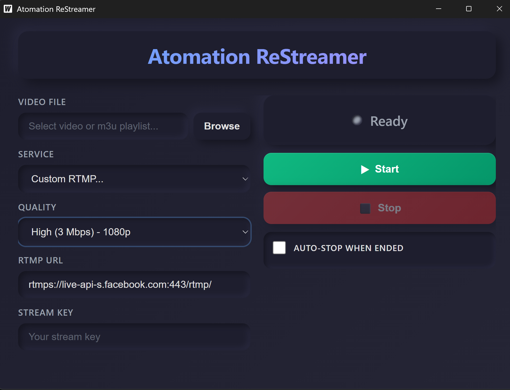

# Atomation ReStreamer

A desktop application for streaming video files to RTMP servers (YouTube, Facebook, or custom RTMP) without needing vMix or OBS.

## Screenshot



*Modern dark neomorphic UI with YouTube, Facebook, and custom RTMP support*

## Features

- **Dark Neomorphic UI** - Modern, clean interface with soft shadows
- **Stream Health Monitoring** - Real-time connection health tracking (healthy, degraded, reconnecting, disconnected)
- **Auto-Reconnect** - Automatic reconnection with up to 3 retry attempts
- **Quality Presets** - Four streaming quality options (Low 540p, Medium 720p, High 1080p, Ultra 1080p)
- **Smart Stop Confirmation** - Warns before stopping streams with significant time remaining
- **Multi-Service Support** - Stream to YouTube, Facebook, or any custom RTMP server
- **Stream Timer** - Real-time display of elapsed, remaining, and total time
- Stream any video file (MP4, AVI, MOV, MKV, FLV, WMV, etc.)
- Built with Go and Wails for cross-platform support
- No need for heavy streaming software like vMix or OBS

## Prerequisites

Before building and running ReStreamer, you need to install:

1. **Go** (version 1.21 or later)
   - Download from: https://golang.org/dl/
   - Verify installation: `go version`

2. **Wails CLI**
   ```bash
   go install github.com/wailsapp/wails/v2/cmd/wails@latest
   ```
   - Verify installation: `wails version`

3. **FFmpeg** (required for video streaming)
   - **Option 1:** Run the included batch script (Windows):
     ```bash
     download-ffmpeg.bat
     ```
   - **Option 2:** Download manually from https://ffmpeg.org/download.html
   - **Option 3:** Install via package manager:
     - Windows (Chocolatey): `choco install ffmpeg`
     - macOS (Homebrew): `brew install ffmpeg`
     - Linux: `sudo apt install ffmpeg` or `sudo yum install ffmpeg`
   - Verify installation: `ffmpeg -version`

## Installation

1. **Clone or download this repository**

2. **Install Go dependencies**
   ```bash
   go mod download
   ```

3. **Install FFmpeg** (if not already installed)
   - On Windows, simply run: `download-ffmpeg.bat`
   - Or follow the FFmpeg installation instructions above

## Building the Application

### Development Mode

Run the application in development mode with hot-reload:

```bash
wails dev
```

### Production Build

Build a production executable:

```bash
wails build
```

The built application will be in the `build/bin` directory.

## Usage

1. **Launch ReStreamer**
   - In development: `wails dev`
   - Production: Run the executable from `build/bin/Atomation-ReStreamer.exe`

2. **Get your streaming credentials**
   - For YouTube: Get your stream key from YouTube Studio
   - For Facebook: Get your stream key from Facebook Live Producer
   - For custom RTMP: Get credentials from your streaming service

3. **Configure the stream**
   - Click "Browse" to select your video file
   - Select your service from the dropdown (YouTube, Facebook, or Custom RTMP)
   - Enter your Stream Key

4. **Start streaming**
   - Click "Start"
   - Your video will begin streaming
   - The status indicator will show "Streaming" while active

5. **Stop streaming**
   - Click "Stop" when you're done

## Streaming Service URLs

**YouTube Live:**
```
rtmp://a.rtmp.youtube.com/live2
```

**Facebook Live:**
```
rtmps://live-api-s.facebook.com:443/rtmp/
```

For custom RTMP servers, enter your own server URL.

## Streaming Settings

ReStreamer includes four quality presets optimized for different use cases:

### Quality Presets

| Preset | Resolution | Max Bitrate | Buffer Size | Description |
|--------|-----------|-------------|-------------|-------------|
| **Low** | 960x540 | 1000 kbps | 2000 kbps | 540p, for slow connections |
| **Medium** | 1280x720 | 2000 kbps | 4000 kbps | 720p, balanced |
| **High** | 1920x1080 | 3000 kbps | 6000 kbps | 1080p, default |
| **Ultra** | 1920x1080 | 5000 kbps | 10000 kbps | 1080p high quality |

### FFmpeg Settings

All presets use these encoding settings:

- **Video Codec:** H.264 (libx264)
- **Encoding Preset:** veryfast (balance between speed and quality)
- **Audio Codec:** AAC
- **Audio Bitrate:** 128 kbps
- **Audio Sample Rate:** 44100 Hz
- **Pixel Format:** yuv420p
- **GOP Size:** 50 frames

These settings are optimized for smooth streaming to most platforms while maintaining good quality.

## Troubleshooting

### "FFmpeg not found" error

**Solution:** Make sure FFmpeg is installed and either:
- Available in your system PATH, or
- Placed in the same directory as the ReStreamer executable

### Stream fails to start

**Possible causes:**
- Invalid RTMP URL or Stream Key
- Video file is corrupted or unsupported format
- Network connectivity issues
- Streaming service is down

**Solutions:**
- Verify your Stream Key in your streaming service dashboard
- Try a different video file
- Check your internet connection
- Verify streaming service status

### Video plays too fast or too slow

The `-re` flag in FFmpeg ensures the video plays at its native frame rate. If you're still experiencing issues, the video file may have incorrect metadata.

### Poor stream quality

The default settings balance quality and performance. If you need higher quality:
1. Edit `streamer.go`
2. Increase the `-maxrate` value (e.g., `5000k` for 5 Mbps)
3. Change preset to `medium` or `slow` for better compression
4. Rebuild the application

## Project Structure

```
ReStreamer/
├── main.go                 # Application entry point
├── app.go                  # Application logic and Wails bindings
├── streamer.go             # FFmpeg streaming implementation
├── go.mod                  # Go module dependencies
├── wails.json              # Wails configuration
├── download-ffmpeg.bat     # FFmpeg download script (Windows)
├── frontend/
│   └── dist/
│       ├── index.html      # Main UI
│       ├── style.css       # Styling
│       ├── app.js          # Frontend logic
│       └── wailsjs/        # Wails runtime bindings (auto-generated)
└── build/                  # Build output (generated)
```

## Advanced Usage

### Custom Streaming Settings

To modify streaming settings, edit the FFmpeg arguments in `streamer.go`:

```go
args := []string{
    "-re",                  // Read at native frame rate
    "-i", videoPath,        // Input file
    "-c:v", "libx264",      // Video codec
    "-preset", "veryfast",  // Encoding speed
    "-maxrate", "3000k",    // Max bitrate
    // ... modify as needed
}
```

### Loop Video

To loop a video continuously, add these arguments before `-i`:

```go
"-stream_loop", "-1",  // Loop indefinitely
```

### Stream Multiple Videos

To create a playlist, you can use FFmpeg's concat demuxer. Create a text file with your videos and modify the input arguments accordingly.

## Building for Distribution

### Windows

```bash
wails build -platform windows/amd64
```

### macOS

```bash
wails build -platform darwin/universal
```

### Linux

```bash
wails build -platform linux/amd64
```

## Support

For issues related to:
- **Atomation ReStreamer:** Create an issue in this repository
- **Streaming services:** Contact your streaming service support
- **FFmpeg:** Visit https://ffmpeg.org/

## License

This project is licensed under the MIT License - see the [LICENSE](LICENSE) file for details.

## Credits

- Built with [Wails](https://wails.io/)
- Powered by [FFmpeg](https://ffmpeg.org/)
- Created by Atomation
